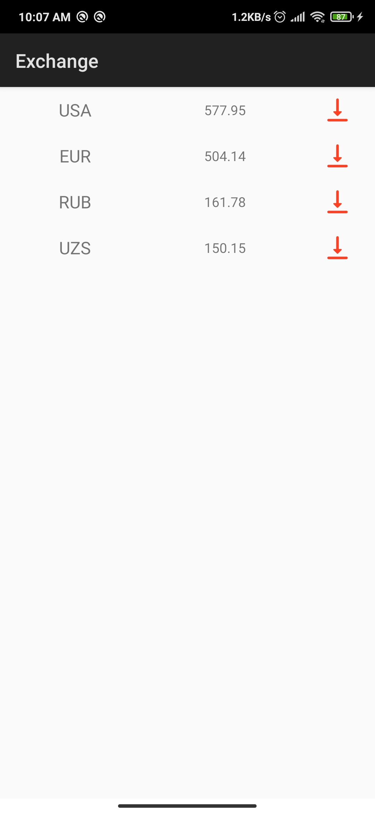

# Exchange

Example SocketIO with MVVM

```java
public class SocketVM extends ViewModel {

    private Socket io;
    public LiveData<List<Exchange>> exchangeLiveData;

    public SocketVM() {
        try {
            io = IO.socket("http://localhost:9999");
            exchangeLiveData = new SocketEvent("my_event", io);
            io.connect();
        } catch (URISyntaxException e) {
            e.printStackTrace();
        }
    }

    @Override
    protected void onCleared() {
        io.disconnect();
        super.onCleared();
    }
}
```



